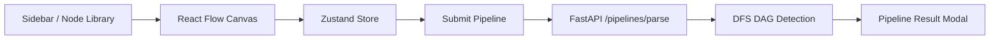

# VectorShift Pipeline Builder

A polished full-stack submission for the VectorShift Frontend Technical Assessment.

The project combines a React + React Flow editor with a FastAPI analysis service. Users can compose pipelines visually, connect nodes, submit the graph to the backend, and receive a graph analysis result that includes node count, edge count, and DAG status.

## Overview

This implementation focuses on two things:

- meeting the assessment requirements end-to-end
- demonstrating the kind of engineering decisions that make the codebase easy to extend after the assessment

Core capabilities:

- reusable `BaseNode` abstraction for all node UI
- node metadata registry for scalable node definitions
- draggable and tap-friendly node library
- responsive canvas for desktop, tablet, and mobile
- `TextNode` variable parsing from `{{variable}}` placeholders
- dynamic React Flow handles generated from detected variables
- FastAPI graph analysis with DFS-based cycle detection
- frontend pipeline validation before backend submission
- modal-based pipeline result feedback instead of plain browser alerts

## Tech Stack

- Frontend: React, Create React App, React Flow, Zustand, Dagre
- Backend: FastAPI, Pydantic

## Project Structure

```text
VectorShift/
|-- backend/
|   |-- __init__.py
|   |-- graph_utils.py
|   |-- main.py
|   `-- models.py
`-- frontend/
    |-- public/
    |-- src/
    |   |-- components/
    |   |   |-- NodeItem.js
    |   |   |-- PipelineCanvas.js
    |   |   |-- PipelineResultModal.js
    |   |   `-- Sidebar.js
    |   |-- nodes/
    |   |   |-- APINode.js
    |   |   |-- BaseNode.js
    |   |   |-- ConditionNode.js
    |   |   |-- DatabaseNode.js
    |   |   |-- InputNode.js
    |   |   |-- LLMNode.js
    |   |   |-- LoggerNode.js
    |   |   |-- MathNode.js
    |   |   |-- OutputNode.js
    |   |   |-- TextNode.js
    |   |   `-- nodeRegistry.js
    |   |-- styles/
    |   |   |-- editor.css
    |   |   `-- node.css
    |   |-- utils/
    |   |   |-- extractVariables.js
    |   |   |-- layout.js
    |   |   `-- validatePipeline.js
    |   |-- App.js
    |   |-- index.js
    |   |-- store.js
    |   `-- submit.js
    |-- package.json
    `-- README.md
```

## Architecture

### Frontend flow

1. `Sidebar` exposes node types from `nodeRegistry.js`
2. `PipelineCanvas` renders the graph with React Flow
3. Zustand in `store.js` owns graph state and connection updates
4. `submit.js` validates the graph and posts it to the backend
5. `PipelineResultModal` presents the analysis result

### Backend flow

1. FastAPI receives `{ nodes, edges }` at `POST /pipelines/parse`
2. Pydantic models validate the request shape
3. `graph_utils.py` checks whether the graph is acyclic
4. FastAPI returns `{ num_nodes, num_edges, is_dag }`

### System diagram



## Node Abstraction

The shared node surface lives in `src/nodes/BaseNode.js`.

It provides:

- consistent container styling
- configurable title
- optional icon support
- configurable input handles
- configurable output handles
- a shared content area for node-specific controls
- node metadata such as port counts and node id

Example:

```jsx
<BaseNode
  title="Math Node"
  icon="➗"
  inputs={[{ id: 'a' }, { id: 'b' }]}
  outputs={[{ id: 'result' }]}
>
  <p>Performs calculations</p>
</BaseNode>
```

This keeps new nodes small and focused. Most node files only define their unique fields or description.

## Node Metadata Registry

`src/nodes/nodeRegistry.js` centralizes node definitions in one place.

Each node entry contains:

- `label`
- `description`
- `icon`
- `accent`
- `color`
- `component`

This registry is reused by:

- the node library sidebar
- React Flow `nodeTypes`
- minimap colors

That avoids the common problem of adding a node in one file and forgetting the other two places that also need updating.

## Text Node Variable System

`TextNode` is designed to feel dynamic and useful instead of static.

Features:

- auto-resizing textarea using `scrollHeight`
- width growth based on content length
- variable extraction using `src/utils/extractVariables.js`
- unique handle generation for each valid `{{variableName}}`

Example input:

```text
Generate a summary of {{article}} using {{model}}
```

Generated input handles:

- `article`
- `model`

This mirrors how template-driven pipeline tools expose data dependencies visually.

## Pipeline Validation

Before the frontend sends a request to the backend, it validates the current graph using `src/utils/validatePipeline.js`.

Checks include:

- at least one node exists
- at least one edge exists
- disconnected nodes produce a warning

This prevents avoidable backend calls and gives the user more helpful feedback earlier.

## DAG Detection

The backend determines whether the submitted pipeline is a DAG using DFS cycle detection in `backend/graph_utils.py`.

High-level algorithm:

1. build an adjacency list from the directed edges
2. visit each node with DFS
3. track the current recursion stack
4. if DFS reaches a node already on the active stack, a cycle exists
5. if no cycle is found, the graph is a DAG

Pseudo flow:

```text
dfs(node):
  mark node visited
  add node to recursion stack

  for each neighbor:
    if neighbor not visited:
      dfs(neighbor)
    if neighbor already in recursion stack:
      cycle found

  remove node from recursion stack
```

This makes the backend analysis deterministic, fast, and easy to reason about.

## UI and UX Highlights

The editor is designed to feel closer to a product UI than a default assessment demo.

Included UX features:

- drag-and-drop node sidebar
- tap-to-add flow for touch devices
- minimap for large pipelines
- zoom controls and fit view
- grid background
- auto layout with Dagre
- polished result modal
- responsive desktop, tablet, and mobile layouts
- touch-friendly controls and larger hit areas on smaller devices

## Engineering Decisions

### Why use `BaseNode`?

Without a shared base component, every node duplicates the same container layout, handle rendering, spacing, metadata, and styling. That makes the code noisy and increases the cost of every UI change.

Using `BaseNode` means:

- a new node can be created in a few lines
- styling remains consistent across the editor
- handle behavior is standardized
- node files stay focused on domain-specific behavior

### Why add a node registry?

Node metadata naturally belongs in a single source of truth. A registry makes the editor easier to extend and keeps the sidebar, minimap, and canvas configuration in sync.

### Why validate on the frontend and backend?

Frontend validation improves usability by catching empty or obviously incomplete graphs immediately. Backend validation and analysis remain the source of truth for the final graph result.

### Why replace `alert()` with a modal?

The modal provides richer feedback, better formatting, and a more professional interaction model than a blocking browser alert.

## Running the Project

### Backend

From `backend/`:

```powershell
cd D:\VectorShift\backend
python -m uvicorn main:app --reload
```

Backend URL:

```text
http://127.0.0.1:8000
```

### Frontend

From `frontend/`:

```powershell
cd D:\VectorShift\frontend
npm install
npm start
```

Frontend URL:

```text
http://localhost:3000
```

## API Contract

### `POST /pipelines/parse`

Request:

```json
{
  "nodes": [
    { "id": "input-1" },
    { "id": "text-1" },
    { "id": "llm-1" }
  ],
  "edges": [
    { "source": "input-1", "target": "text-1" },
    { "source": "text-1", "target": "llm-1" }
  ]
}
```

Response:

```json
{
  "num_nodes": 3,
  "num_edges": 2,
  "is_dag": true
}
```

## Assessment Coverage

This repository now demonstrates:

- reusable node abstraction
- additional node types built on the abstraction
- modern React Flow editor UX
- dynamic `TextNode` behavior
- graph submission from frontend to backend
- backend DAG analysis
- modular utility-driven architecture
- documentation that explains the reasoning behind the implementation

## Useful Commands

```powershell
# frontend
npm start
npm run build

# backend
python -m uvicorn main:app --reload
```
